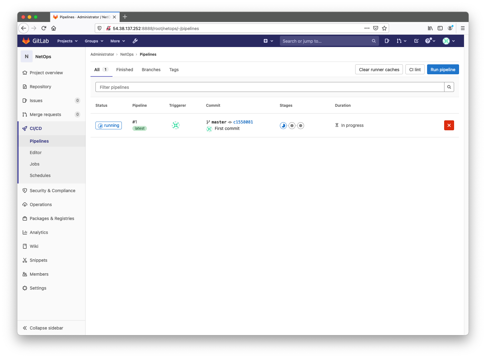

# NetOps Quickstart

This is a DEMO project (thus, do not use in production environment) with the purpose of giving on overview on some example tools, methods and procedures focused on NetOps best practice.

We've tried to put everything together in an all-in-one stack deployment, from code to network devices, passing passing through automation playbooks, validation and testing.

It is important to say that this is not THE Solution (with capitol S), but a possible approach that can be helpful to understand the power of NetOps and give some initial spark to those who want to investigate this subject for the first time.

We focus on the main goals of NetOps methodology, in a closed-loop telemetry/automation model:
* **Infrascruture as Cdde** (aka IaC)
* **Versioning**
* **Automation**
* **Monitoring**

# Components

Below an architecture on our DEMO environment, the tools we have chosen and the connections between them:

|  |
|:--:| 
| *NetOps Stack* |

> Note: All the tools in this architecture are deployed using Docker and Docker-compose

## Arista cEOS Topology

We are testing our environment with a simple 3-nodes Spine/Leaf topology. We have chosen rely on [Arista](https://www.arista.com/en/) technology beacuse of the flexibility and semplicity they provide. In fact we are using containerized EOS images in conjunctions with [Docker-topo NG](https://github.com/Vista-Technology/docker-topo-ng), a software that allows you to replicate a network topology using docker technologies.

We also added to Host nodes, one per Leaf, useful to test network connectivity if everything is ok.

## Gitalb CI/CD

We are using [Gitlab](https://about.gitlab.com/) for 2 reasons:
* **GIT** versioning 
    * for IaC definitions of network devices
    * for automation playbooks
* Embedded **DevOps** functionality
    * CI/CD Piepline triggers and definitions

Our Gitlab project is composed by:
* **automation** folder
    * contains al Ansible-related files and folders
* **config** folder
    * contains the YAML definitions of the 3 devices
* **gitlab-ci.yml** file
    * describe the CI/CD process that take place on every change

The 3 network devices are described using YAML definitions, in order to respect **Infrastructure as Code** best practice, as follows:

```yaml
## Leaf-1

interfaces:
  - name: Ethernet1
    ipv4: 10.0.254.1/31
routerid: 1.1.1.1/32
bgp:
  asn: 65001
  neighbours: 
    - ipv4: 10.0.254.0
      remote_asn: 65100
vlan:
  id: 10
  svi: 192.168.10.1/24
  interface: Ethernet10
```

```yaml
## Leaf-2

interfaces:
  - name: Ethernet1
    ipv4: 10.0.254.3/31
routerid: 1.1.1.2/32
bgp:
  asn: 65002
  neighbours: 
    - ipv4: 10.0.254.2
      remote_asn: 65100
vlan:
  id: 20
  svi: 192.168.20.1/24
  interface: Ethernet10
```

```yaml
## Spine-1

interfaces:
  - name: Ethernet1
    ipv4: 10.0.254.0/31
  - name: Ethernet2
    ipv4: 10.0.254.2/31
routerid: 1.1.1.100/32
bgp:
  asn: 65100
  neighbours:
    - ipv4: 10.0.254.1
      remote_asn: 65001
    - ipv4: 10.0.254.3
      remote_asn: 65002
```

## Ansible
We make use of 3 simple, demostrative, [Ansible](https://www.ansible.com/) playbooks to perform all the **automation** staff.

> Note: Even the creating process of all the demo environment is built with Ansible

Ansible automation is launched by the Gitlan pipeline. We have devided all the stuff in 3 topics:
* Automatically launch **validation** processes
  * _playbooks/validate.yaml_
* Auotmatically deploy **configurations** on devices, and configure the monitoring stack
  * _playbooks/intended.yaml_
* Automatically **test** the final environment
  * _playbooks/ping.yaml_

Inside the _automation_ folder of this project you can find all files related to Ansible automation, regarding the NetOps process.
We use some collections and roles to perform the tasks (as you can see in the _requirements.yaml_ file):
* Collections:
  * lvrfrc87.git_acp
  * arista.eos
* Roles:
  * batfish.base

As you can see, the _host_vars_ folder is empty. It will be filled with **IaC** configuration declarations by the Gitlab **pipeline**.

The arista.eos collection is the key to perform configuration deployment on the devices

```yaml
---
- name: Configure device
  arista.eos.eos_config:
    src: template-config-all.j2
    replace: config
    match: none
```
We use a jinja2 template, filled with IaC variables, to get the final configuration

```python
!
hostname {{ inventory_hostname }}
!
spanning-tree mode mstp
!
no aaa root
!
aaa authorization exec default local
!
username {{ management.username }} privilege 15 secret sha512 {{ management.password }}
!
ip access-list def2
   9 permit tcp any any eq 8080
   10 permit icmp any any
   20 permit ip any any tracked
   30 permit udp any any eq bfd ttl eq 255
   40 permit udp any any eq bfd-echo ttl eq 254
   50 permit udp any any eq multihop-bfd
   60 permit udp any any eq micro-bfd
   70 permit ospf any any
   80 permit tcp any any eq ssh telnet www snmp bgp https msdp ldp netconf-ssh gnmi
   90 permit udp any any eq bootps bootpc snmp rip ntp ldp
   100 permit tcp any any eq mlag ttl eq 255
   110 permit udp any any eq mlag ttl eq 255
   120 permit vrrp any any
   130 permit ahp any any
   140 permit pim any any
   150 permit igmp any any
   160 permit tcp any any range 5900 5910
   170 permit tcp any any range 50000 50100
   180 permit udp any any range 51000 51100
   190 permit tcp any any eq 3333
   200 permit tcp any any eq nat ttl eq 255
   210 permit tcp any eq bgp any
   220 permit rsvp any any
   exit
!
management api http-commands
   no shutdown
   exit

!
interface {{ intf.name }}
   no switchport
   ip address {{ intf.ipv4 }}
   exit

!

vlan {{ vlan.id }}
!
interface Vlan{{ vlan.id }}
   ip address {{ vlan.svi }}
   exit
!
interface {{ vlan.interface }}
   switchport
   switchport mode access 
   switchport access vlan {{ vlan.id }}
   exit


!
ip routing
!
route-map RMAP-CONNECTED-BGP permit 1000
!
interface Loopback0
   description ROUTER-ID
   ip address {{ routerid }}
   exit
!
router bgp {{ bgp.asn }}

   router-id {{ rid[0] }}


   neighbor {{ peer_ip }} remote-as {{ neighbor.remote_asn }}
   neighbor {{ peer_ip }} send-community
   neighbor {{ peer_ip }} maximum-routes 12000

   redistribute connected route-map RMAP-CONNECTED-BGP
   maximum-paths 2
   exit
!

!
system control-plane
   ip access-group def2 in
   exit
!
daemon TerminAttr
   exec /usr/bin/TerminAttr -disableaaa
   no shutdown
   exit
!
daemon ocprometheus
   exec /mnt/flash/ocprometheus -config /mnt/flash/ocprometheus.yml -addr localhost:6042
   no shutdown
   exit
!
logging host {{ logging_remote_host }} {{ logging_remote_port }} protocol tcp
logging format hostname fqdn
!
end

```

## Batfish
[Batfish](https://www.batfish.org/) is an open source **network configuration analysis** tool.

We have deployed a Batfish server inside our stack and we run some simple demostrative **validation** against it. As described before, we run this validations using Ansible automation.

For example, we want to validate BGP neighbourship
```yaml
- name: Generate intended config to test
  template:
    src: config.j2
    dest: "validation/workshop/configs/{{inventory_hostname}}"

- name: Setup connection to Batfish service
  bf_session:
    host: localhost
    name: local_batfish
  delegate_to: localhost
  run_once: true

- name: Initialize the example network
  bf_init_snapshot:
    network: workshop
    snapshot: workshop
    snapshot_data: ../validation/workshop
    overwrite: true
  run_once: true
  delegate_to: localhost

- name: Retrieve Batfish Facts
  bf_extract_facts:
    output_directory: ../validation/workshop/data/bf_facts
  register: bf_facts
  run_once: true
  delegate_to: localhost

- name: Display neighbourships for all nodes
  debug:
    msg: " {{item.value.BGP.Neighbors}} "
  with_dict: "{{bf_facts.result.nodes}}"
  loop_control:
    label: "{{item.key}}.BGP.Neighbors"
  run_once: true
  delegate_to: localhost

- name: Validate the configuration of network devices
  bf_assert:
    assertions:
      - type: assert_no_undefined_references
        name: Confirm that there are NO undefined references on any network device
      - type: assert_no_incompatible_bgp_sessions
        name: Confirm that all BGP peers are properly configured
      - type: assert_no_unestablished_bgp_sessions
        name: Confirm that all compatible BGP peers establish sessions
  run_once: true
  delegate_to: localhost
```

## Consul
We have introduced [Consul]() simply to simulate a **service discovery** component inside our **automation** stack.

This kind of objects are very usefull when we have to deal with automation tasks. In this way, within the _intended.yaml_ playbook, we can *register* a device to be monitored by the monitoring tools without specify any further configuration inside Prometheus

```yaml
---
- name: Register Consul service
  community.general.consul:
    service_name: "Arista Monitoring"
    service_port: "{{ metrics_port }}"
    service_id: "{{ inventory_hostname }}"
    service_address: "{{ ansible_host }}"
    host: "{{ consul_host }}"
    tags: 
      - "_device={{ inventory_hostname }}"
```

Prometheus itself has a service discovery plugin to be able to get hosts from registered device inside Consul.

## Prometheus, Loki and Grafana
Finally, as a complete Monitoring/Telemetry/Log aggregation stack we have chosen:
* [Prometheus](https://prometheus.io/)
  * scrapes metrics information of the Arista devices, both directly (thanks to OCPrometheus daemon inside EOS) and via custom eAPI exporter (just for demonstration sake, it is absolutely not necessary to run both mechanisms)
* [Loki](https://grafana.com/oss/loki/)
  * scrapes devices logs, through the help of [Promtail](https://grafana.com/docs/loki/latest/clients/promtail/) (make log available for scraping) component and [Syslog-NG](https://www.syslog-ng.com/) ( first catches and parses logs)
* [Grafana](https://grafana.com/oss/grafana/)
  * provides visualization dashboards

# CI/CD Process

|  |
|:--:| 
| *CI/CD Pipeline detail* |
We use the default CI/CD mechanism inside Gitlab to perform the pipeline process.

Therefore we provide a simple _.gitlab-ci.yml_ file that describes all the stages
```yaml
stages:
  - validate
  - deploy
  - test

batfish-validation:
  stage: validate
  script:
    - chmod 755 automation
    - cp configs/*.yml automation/host_vars/
    - cd automation
    - ansible-galaxy install -r requirements.yml
    - ansible-playbook -e 'ansible_python_interpreter=/usr/bin/python3' playbooks/validate.yaml

deploy-configurations:
  stage: deploy
  script:
    - chmod 755 automation
    - cp configs/*.yml automation/host_vars/
    - cd automation
    - ansible-galaxy install -r requirements.yml
    - ansible-playbook -e 'ansible_python_interpreter=/usr/bin/python3' playbooks/intended.yaml

ping-test:
  stage: test
  script:
    - chmod 755 automation
    - cp configs/*.yml automation/host_vars/
    - cd automation
    - chmod 400 demo.key
    - ansible-galaxy install -r requirements.yml
    - ansible-playbook -e 'ansible_python_interpreter=/usr/bin/python3' playbooks/ping.yaml
```
We have build a custom docker image that the runner can use to perform tasks inside stages. It containes all the softwares necessary.

# Pre-requisite
You can run all the demo environment inside a single Linux-based host.

We recommend to use a not-too-old linux distribution, with at least  4 CPUs and 16GB RAM.

This softwares has to be present before launch the installation:
* python3
* pip3
* Python virtualenv
* docker

# How to install
First clone this repository on your server and chanage directory inside the root.

Then create the virtualenv and install all the python requirements (this action could takes long to finish)

```console
foo@bar:~$ cd netops-quickstart
foo@bar:~$ virtualenv .venv
foo@bar:~$ source .venv/bin/activate
(.venv)foo@bar:~$ cd build
(.venv)foo@bar:~$ pip install -r requirements.txt
```

Download from Arista portal the latest cEOS images and put it inside the topology folder, with the name _cEOS-Lab.tar.xz_

```console
(.venv)foo@bar:~$ ls -al topology

total 391776
drwxrwxr-x 4 ubuntu ubuntu      4096 May  7 15:17 .
drwxrwxr-x 8 ubuntu ubuntu      4096 May  7 14:28 ..
drwxrwxr-x 2 ubuntu ubuntu      4096 May  7 15:15 alpine-host
-rw-r--r-- 1 ubuntu ubuntu 401152996 May  7 15:13 cEOS-Lab.tar.xz
drwxrwxr-x 2 ubuntu ubuntu      4096 May  7 15:17 configs
-rw-rw-r-- 1 ubuntu ubuntu       638 May  7 14:28 topology.yaml
```

Now within the virtual environment you can launch Ansible automation that builds all the infrastructure (it will takes approximately 7/8 minutes)

```console
(.venv)foo@bar:~$ ansible-playbook build.yml


PLAY [lab] *************************************************************************************************************************************************************************

TASK [build : Generate SSH key pair for Hosts in topology] *************************************************************************************************************************
changed: [Spine-1]

TASK [build : Build Host docker image] *********************************************************************************************************************************************
changed: [Spine-1]

TASK [build : Import & Build cEOS image] *******************************************************************************************************************************************
changed: [Spine-1]

TASK [build : Generate Arista configuration from templates] ************************************************************************************************************************
changed: [Spine-1]
changed: [Leaf-1]
changed: [Leaf-2]

TASK [build : Start Arista topology] ***********************************************************************************************************************************************
changed: [Spine-1]

TASK [build : Pause for 30 seconds to topology creation] ***************************************************************************************************************************
Pausing for 30 seconds
(ctrl+C then 'C' = continue early, ctrl+C then 'A' = abort)
ok: [Spine-1]

TASK [build : Copy OCPrometheus binary and configuration] **************************************************************************************************************************
changed: [Spine-1]
changed: [Leaf-1]
changed: [Leaf-2]

TASK [build : Pause for 90 seconds to topology up & running] ***********************************************************************************************************************
Pausing for 90 seconds
(ctrl+C then 'C' = continue early, ctrl+C then 'A' = abort)
ok: [Spine-1]

TASK [build : Build Network CI/CD docker image for Gitlab Runner] ******************************************************************************************************************
changed: [Spine-1]

TASK [build : Start all stack architecture] ****************************************************************************************************************************************
changed: [Spine-1]

TASK [build : Pause for 3 minutes, waiting for the stack comes up] *****************************************************************************************************************
Pausing for 180 seconds
(ctrl+C then 'C' = continue early, ctrl+C then 'A' = abort)
ok: [Spine-1]

TASK [build : Register Gitlab Runner] **********************************************************************************************************************************************
changed: [Spine-1]

PLAY RECAP *************************************************************************************************************************************************************************
Leaf-1                     : ok=2    changed=2    unreachable=0    failed=0    skipped=0    rescued=0    ignored=0
Leaf-2                     : ok=2    changed=2    unreachable=0    failed=0    skipped=0    rescued=0    ignored=0
Spine-1                    : ok=12   changed=9    unreachable=0    failed=0    skipped=0    rescued=0    ignored=0

```

At the end of the playbook you will have this situation

```console
(.venv)foo@bar:~$ docker ps

CONTAINER ID   IMAGE                         COMMAND                  CREATED          STATUS                   PORTS                                                                                                                                                                                                                                       NAMES
605125504e40   grafana/loki:latest           "/usr/bin/loki -conf…"   5 minutes ago    Up 5 minutes             0.0.0.0:3100->3100/tcp, :::3100->3100/tcp                                                                                                                                                                                                   loki
54d06e721082   prom/prometheus:latest        "/bin/prometheus --w…"   5 minutes ago    Up 5 minutes             0.0.0.0:9090->9090/tcp, :::9090->9090/tcp                                                                                                                                                                                                   prometheus
49a918ab0d36   arista-eapi-exporter          "python -u ./main.py"    5 minutes ago    Up 5 minutes             0.0.0.0:9200->9200/tcp, :::9200->9200/tcp                                                                                                                                                                                                   arista-eapi-exporter
01c192a0744b   gitlab/gitlab-ce:latest       "/assets/wrapper"        5 minutes ago    Up 5 minutes (healthy)   80/tcp, 443/tcp, 0.0.0.0:8822->22/tcp, :::8822->22/tcp, 0.0.0.0:8888->9080/tcp, :::8888->9080/tcp                                                                                                                                           gitlab-lab
1785c34d6fec   gitlab/gitlab-runner:latest   "/usr/bin/dumb-init …"   5 minutes ago    Up 5 minutes                                                                                                                                                                                                                                                         runner-lab
9af5d52d0f5f   grafana/grafana:latest        "/run.sh"                5 minutes ago    Up 5 minutes             0.0.0.0:3000->3000/tcp, :::3000->3000/tcp                                                                                                                                                                                                   grafana
acc1d7780a5d   batfish/allinone              "./wrapper.sh"           5 minutes ago    Up 5 minutes             8888/tcp, 0.0.0.0:9996-9998->9996-9998/tcp, :::9996-9998->9996-9998/tcp                                                                                                                                                                     batfish
f81482213ebb   bitnami/consul:1-debian-10    "/opt/bitnami/script…"   5 minutes ago    Up 5 minutes             0.0.0.0:8300-8301->8300-8301/tcp, :::8300-8301->8300-8301/tcp, 0.0.0.0:8500->8500/tcp, 0.0.0.0:8301->8301/udp, :::8500->8500/tcp, :::8301->8301/udp, 0.0.0.0:8600->8600/tcp, :::8600->8600/tcp, 0.0.0.0:8600->8600/udp, :::8600->8600/udp   consul
f9690138a56e   balabit/syslog-ng             "/usr/sbin/syslog-ng…"   5 minutes ago    Up 5 minutes (healthy)   601/tcp, 514/udp, 6514/tcp, 0.0.0.0:51400->514/tcp, :::51400->514/tcp                                                                                                                                                                       syslog-ng
6d81eb4cf9b4   grafana/promtail:latest       "/usr/bin/promtail -…"   5 minutes ago    Up 5 minutes             0.0.0.0:9080->9080/tcp, :::9080->9080/tcp, 0.0.0.0:15140->1514/tcp, :::15140->1514/tcp                                                                                                                                                      promtail
07d00af9fd15   alpine-host:latest            "/home/alpine/entryp…"   12 minutes ago   Up 12 minutes            0.0.0.0:2001->22/tcp, :::2001->22/tcp, 0.0.0.0:8001->443/tcp, :::8001->443/tcp, 0.0.0.0:8881->8080/tcp, :::8881->8080/tcp                                                                                                                   lab_Host-2
73f42929556d   alpine-host:latest            "/home/alpine/entryp…"   12 minutes ago   Up 12 minutes            0.0.0.0:2000->22/tcp, :::2000->22/tcp, 0.0.0.0:8000->443/tcp, :::8000->443/tcp, 0.0.0.0:8880->8080/tcp, :::8880->8080/tcp                                                                                                                   lab_Host-1
b5b11322bbde   ceos:latest                   "/sbin/init systemd.…"   12 minutes ago   Up 12 minutes            0.0.0.0:2004->22/tcp, :::2004->22/tcp, 0.0.0.0:8004->443/tcp, :::8004->443/tcp, 0.0.0.0:8884->8080/tcp, :::8884->8080/tcp                                                                                                                   lab_Spine-1
1823eb54a25f   ceos:latest                   "/sbin/init systemd.…"   12 minutes ago   Up 12 minutes            0.0.0.0:2003->22/tcp, :::2003->22/tcp, 0.0.0.0:8003->443/tcp, :::8003->443/tcp, 0.0.0.0:8883->8080/tcp, :::8883->8080/tcp                                                                                                                   lab_Leaf-2
03646ccf2cf6   ceos:latest                   "/sbin/init systemd.…"   12 minutes ago   Up 12 minutes            0.0.0.0:2002->22/tcp, :::2002->22/tcp, 0.0.0.0:8002->443/tcp, :::8002->443/tcp, 0.0.0.0:8882->8080/tcp, :::8882->8080/tcp                                                                                                                   lab_Leaf-1
```

# Test your NetOps process

## What we have done so far...

Now that the whole stack is up&running you can easily check if you can access this endpoints:
* **Gitlab server**
  * http://\<ip address of your server\>:8888
  * user: _root_
  * password: _NetOpsVista21!_
* **Grafana**
  * http://\<ip address of your server\>:3000
  * user: _admin_
  * password: _NetOps_
* **Prometheus UI**
  * http://\<ip address of your server\>:9090
* **Consul UI**
  * http://\<ip address of your server\>:8500

You can also access the 2 fake Hosts attached to Leafs, and check that ping between them is not working right now

```console
(.venv)foo@bar:~$ docker exec -it lab_Host-1 /bin/sh

/ $ sudo ping 192.168.20.20
PING 192.168.20.20 (192.168.20.20): 56 data bytes
^C
--- 192.168.20.20 ping statistics ---
13 packets transmitted, 0 packets received, 100% packet loss
/ $
```
So, that means we still have to configure a lot of stuff on Arista devices... (no BGP configuration means no neighbourship means no network reachability between Hosts)

Also, accessing Grafana dashboard, you will see blank data

|  |
|:--:| 
| *Grafana empty dashboard* |

Let's start by creating our GIT project and prepare everything to deploy correct configurations on devices.

## Let's do some magic!

|  |
|:--:| 
| *Login to Gitlab server* |

|  |
|:--:| 
| *Create a new project* |

|  |
|:--:| 
| *Fill project info* |

|  |
|:--:| 
| *TADAAA!* |

Now you can clone your brand new repository and start adding stuff to you project.

```console
foo@bar:~$ cd
foo@bar:~$ git clone http://\<ip address of your server\>:8888/root/netops.git

Cloning into 'netops'...
Username for 'http://54.38.137.252:8888': root
Password for 'http://root@54.38.137.252:8888':
remote: Enumerating objects: 3, done.
remote: Total 3 (delta 0), reused 0 (delta 0), pack-reused 3
Unpacking objects: 100% (3/3), 224 bytes | 224.00 KiB/s, done.

foo@bar:~$ cd netops
foo@bar:~$ ls -al

total 16
drwxrwxr-x 3 ubuntu ubuntu 4096 May 11 13:09 .
drwxr-xr-x 9 ubuntu ubuntu 4096 May 11 13:09 ..
drwxrwxr-x 8 ubuntu ubuntu 4096 May 11 13:09 .git
-rw-rw-r-- 1 ubuntu ubuntu   36 May 11 13:09 README.md
```

Now you can copy some files and folder from this demo repo to the new repo, as follows

```console
foo@bar:~$ cd
foo@bar:~$ cp netops-quickstart/gitlab-ci.yml netops/.gitlab-ci.yml
foo@bar:~$ cp -r netops-quickstart/{configs,automation} netops/
foo@bar:~$ cd netops
foo@bar:~$ ls -al 

total 28
drwxrwxr-x 5 ubuntu ubuntu 4096 May 11 13:15 .
drwxr-xr-x 9 ubuntu ubuntu 4096 May 11 13:09 ..
drwxrwxr-x 8 ubuntu ubuntu 4096 May 11 13:09 .git
-rw-rw-r-- 1 ubuntu ubuntu  996 May 11 13:15 .gitlab-ci.yml
-rw-rw-r-- 1 ubuntu ubuntu   36 May 11 13:09 README.md
drwxrwxr-x 7 ubuntu ubuntu 4096 May 11 13:15 automation
drwxrwxr-x 2 ubuntu ubuntu 4096 May 11 13:15 configs
```

One little small change: you need to insert your demo server IP address inside the inventory

```yaml
lab:
  vars:
    ansible_connection: network_cli
    ansible_network_os: eos
    ansible_user: arista
    ansible_httpapi_pass: arista
    ansible_ssh_pass: arista
    ansible_password: arista
    ansible_become: true
    ansible_become_method: enable
    ansible_httpapi_use_ssl: true
    ansible_httpapi_validate_certs: false
    logging_remote_host: <insert your server IP here> #INSERT YOUR IP HERE!
    logging_remote_port: 51400
    consul_host: consul
  children:
    Spines:
      hosts:
        Spine-1
    Leafs:
      hosts:
        Leaf-1
        Leaf-2
testing:
  vars:
    ansible_become: true
    ansible_user: alpine
    ansible_ssh_private_key_file: demo.key
  children:
    alpine:
      hosts:
        Host-1:
          ip_to_ping: 192.168.20.20
        Host-2:
          ip_to_ping: 192.168.10.10
```

Now it's time to add, commit and push!

```console
foo@bar:~$ git config user.email "admin@example.com"
foo@bar:~$ git config user.name "Administrator" 
foo@bar:~$ git add .
foo@bar:~$ git status

On branch master
Your branch is up to date with 'origin/master'.

Changes to be committed:
  (use "git restore --staged <file>..." to unstage)
	new file:   .gitlab-ci.yml
	new file:   automation/.gitignore
	new file:   automation/ansible.cfg
	new file:   automation/collections/.gitignore
	new file:   automation/host_vars/.gitignore
	new file:   automation/inventory.yml
	new file:   automation/playbooks/intended.yaml
	new file:   automation/playbooks/ping.yaml
	new file:   automation/playbooks/validate.yaml
	new file:   automation/requirements.yml
	new file:   automation/roles/deploy/defaults/main.yml
	new file:   automation/roles/deploy/tasks/main.yml
	new file:   automation/roles/deploy/templates/template-config-all.j2
	new file:   automation/roles/monitoring/tasks/main.yml
	new file:   automation/roles/validate/defaults/main.yml
	new file:   automation/roles/validate/tasks/main.yml
	new file:   automation/roles/validate/templates/config.j2
	new file:   automation/validation/workshop/configs/.gitignore
	new file:   automation/validation/workshop/data/bf_facts/.gitignore
	new file:   configs/Leaf-1.yml
	new file:   configs/Leaf-2.yml
	new file:   configs/Spine-1.yml

foo@bar:~$ git commit -m "First commit"
foo@bar:~$ git push

Username for 'http://54.38.137.252:8888': root
Password for 'http://root@54.38.137.252:8888':
Enumerating objects: 42, done.
Counting objects: 100% (42/42), done.
Delta compression using up to 8 threads
Compressing objects: 100% (28/28), done.
Writing objects: 100% (41/41), 5.68 KiB | 969.00 KiB/s, done.
Total 41 (delta 3), reused 0 (delta 0)
To http://54.38.137.252:8888/root/netops.git
   aabc023..c155808  master -> master
```

After the push, he CI/CD pipeline will take place

|  |
|:--:| 
| *Gitlab CI/CD Pipeline started* |

|  |
|:--:| 
| *Gitlab CI/CD Pipeline stages, in progress* |

|  |
|:--:| 
| *Gitlab CI/CD Pipeline stages, finished successfully* |

We can see the detail of the last stage, where Host-1 and Host-2 can ping each others

|  |
|:--:| 
| *Gitlab CI/CD Pipeline stages output* |

We can also check from docker cli that now the 2 Hosts ping each others

```console
(.venv)foo@bar:~$ docker exec -it lab_Host-1 /bin/sh

/ $ sudo ping 192.168.20.20
PING 192.168.20.20 (192.168.20.20): 56 data bytes
64 bytes from 192.168.20.20: seq=0 ttl=61 time=10.994 ms
64 bytes from 192.168.20.20: seq=1 ttl=61 time=9.132 ms
64 bytes from 192.168.20.20: seq=2 ttl=61 time=8.530 ms
64 bytes from 192.168.20.20: seq=3 ttl=61 time=7.020 ms
64 bytes from 192.168.20.20: seq=4 ttl=61 time=7.871 ms
64 bytes from 192.168.20.20: seq=5 ttl=61 time=6.509 ms
^C
--- 192.168.20.20 ping statistics ---
6 packets transmitted, 6 packets received, 0% packet loss
round-trip min/avg/max = 6.509/8.342/10.994 ms
```

Also Grafana dashboard now show some data and logs

|  |
|:--:| 
| *Grafana* |

## It's time to break everything...

Now, let's try to voluntarily insert wrong data on IaC side. For example we could change an IP address on Leaf-2

|  |
|:--:| 
| *Insert a wrong IP (10.0.154.2 on the BGP configuration of Leaf-2)* |

The excpected behaviour is to fail the first validation step of the CI?CD pipeline.

And in fact here it is

|  |
|:--:| 
| *Failed on Validation stage* |

|  |
|:--:| 
| *Failed on Validation stage, details* |

So it's working! Validation stage prevent something broken to arrive to production environment.

# Clean up the demo stack

If you're tired of the playground you can simply clean all up by running an Ansible playbook

```console
(.venv)foo@bar:~$ cd netops-quickstart/build
(.venv)foo@bar:~$ ansible-playbook clean_up.yml

PLAY [lab] ***********************************************************************************************************************************************************************************************************************************************************************************************************************************************************************************************

TASK [Destroy Arista topology] ***************************************************************************************************************************************************************************************************************************************************************************************************************************************************************************
changed: [Spine-1]

TASK [Destroy the stack] *********************************************************************************************************************************************************************************************************************************************************************************************************************************************************************************
changed: [Spine-1]

TASK [Prune docker stack] ********************************************************************************************************************************************************************************************************************************************************************************************************************************************************************************
changed: [Spine-1]

PLAY RECAP ***********************************************************************************************************************************************************************************************************************************************************************************************************************************************************************************************
Spine-1                    : ok=3    changed=3    unreachable=0    failed=0    skipped=0    rescued=0    ignored=0

```